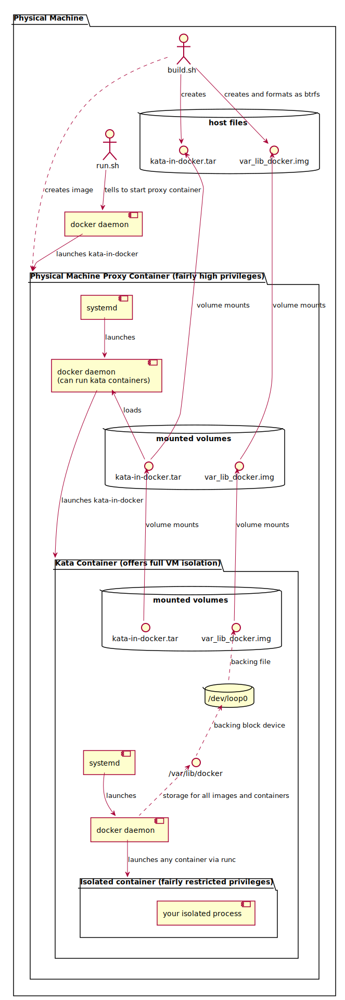

# Docker in Kata Container

## The TLDR;

If you just want to see a docker daemon run in a kata container you can do so with just a few commands.

```bash
THIS_REPO="git@github.com:daniel-noland/docker-in-kata.git"
git clone "$THIS_REPO" && cd docker-in-kata
./initial_setup.sh # Only needed the first time you run or if you would like to start over
./run.sh
```

With that you should be at a root prompt in a tripple nested docker container.

To run a different docker container in the kata container you can (after exiting the previous root shell)

```bash
docker exec -it kata-in-docker \
    docker exec -it kata \
        docker $YOUR_RUN_COMMANDS
```

For more details of how to use this code base see [the how](#how)

## The what

This repo is a proof of concept demo of running a full docker daemon in a [kata container](https://katacontainers.io/).

*NOTE*: While running docker in docker is generally fairly easy it is also somewhat problematic and frequently useless.
See [this repo](https://github.com/jpetazzo/dind#a-word-of-warning) both for details of why the "docker in docker"
approach is often troubled and how you can do it anyway in the event that it is what you actually need.

## The why

Docker and virtual machines both offer different (almost totally orthogonal) approaches to security and isolation.
Kata containers provide the advantages (and some of the disadvantages) of both approaches.

There are several reasons why you might want to run a docker daemon in a kata container.

1. To offer a docker build environment to untrusted users or untrusted build contexts.
2. To ensure that you have precise control over the linux kernel used to run a container.
3. To offer each of several users isolated docker daemons running on the same physical machine.
4. To docker builds/run in a CI/CD system against a fixed linux kernel.
5. To run multiple docker containers within one kata container (e.g. for some networking simulations)
6. To test experimental docker features without changing the configuration of the docker daemon

I am sure others can dream up many more reasons.

## <a name="how"></a>The how

I did several non-obvious things to make a docker daemon run properly inside a kata container.

1. Due to the extremely minimal linux kernel used by default by the upstream kata project I needed to compile a new kata
   kernel.  I choose linux kernel 5.4 since it is the current mainline kernel.  It should be fairly trivial to change
   these scripts to use any kernel you like.  Take a look in the `Dockerfile` for the kernel build section.  The kernel
   `.config` file is simply `COPY`ed in from the assets folder.  Key things I needed to change included:
   * Copy the "official" 4.19 kata kernel `.config` into the 5.4 source folder and run `make oldconfig` to update the
     config file.  I said no to essentially all of the prompts since the goal is to build a very minimal kernel.
   * Ran `make menuconfig` to get to a tui prompt where I
      * Added support for basic network operations (basically everything iptables does)
      * Added support for additional bridging functionality (for my own testing, likely not necessary)
      * Added support for btrfs filesystem (needed for externally mounted block device I use later)
      * Removed support for xfs filesystem (not necessary, I just didn't need it)
      * Added support for vhost and virtualization (as a first swing at making nested kata containers work)
   *NOTE*: The kernel I built is likely fine for many purposes but may or may not be what you are looking for.  Feel
           free to use my kernel config as a starting point for setting up your own.

2. Once I had a kernel I was happy with I needed to build it.  Because I wanted this project to be reasonably portable
   I took the somewhat unusual step of adding an additional level of containerization.  There is an outer
   container which runs (via normal runc, not kata) a full systemd init system and docker daemon.  In addition to being
   useful for my own purposes, this step allowed me to containerize everything about the kernel build step and the kata
   container configuration.  Thus you can test kata without messing with your existing docker daemon at all.  See the
   figure for a visual breakdown of what script does what and how data is mounted between the different containers.

   Note that this step is not strictly necessary, it simply makes things easier for me.  In a real deployment I would
   likely configure the physical machine to run kata containers and eliminate a potentially confusing level of nesting.
   I very much doubt that this additional layer of nesting is offering any security advantage to speak of.

   I call this outer container the "proxy container" since it is functioning as a proxy for a physical host.

3. After I had a proxy container which could run a kata enable docker daemon I did one more slightly odd thing.  I
   `docker save` the proxy container and export the entire image to a `.tar` file.  This step allows me to simply
   `docker load` the same systemd + docker enabled image inside the proxy container.  I launch this container within the
   proxy container with the important addition of the `--runtime=kata` flag.  This step saves me the trouble of building
   a second container capable of running a docker daemon.

4. One additional crucial step deserves some discussion: the default filesystem used by kata containers is 9p.  While 9p
   file systems are great at some things, they are ill suited to the task of running a nested docker container.  To be
   more specific, there is a long standing problem which breaks commands which use the "open-unlink-fstat" idiom (one
   such command is `apt-get update`).  See this [bug report](https://bugs.launchpad.net/qemu/+bug/1336794) for more
   details.

   Further, even if the 9p mount worked, it would be a pain to get any container you built out of the double nested
   container.

   Both of these problems are easily solved via a `btrfs` formatted loopback device.  Thus with some minor linux/docker
   foo in the `setup.sh` script I create, format, and mount a block file named `var_lib_docker.img` to the path
   `/var/lib/docker` in the inner kata container *before I start the docker daemon*.  Mounting this block file causes
   docker to use its `btrfs` graph driver instead of the overlay graph driver.  The `btrfs` driver has the advantage of
   being able transparently compress the files stored on it and to nest essentially infinitely.  If you don't care about
   compression or copy-on-write then I would recommend formatting the block device with ext4.

   

